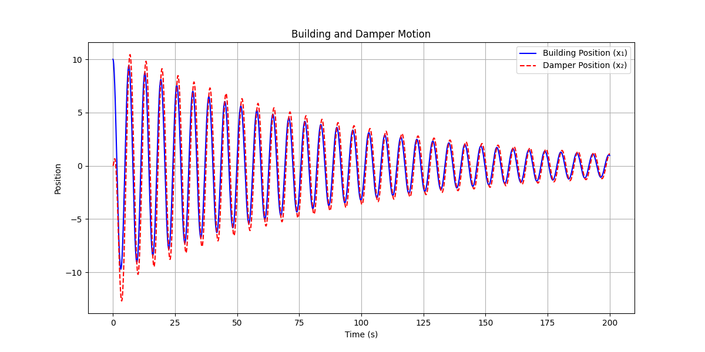
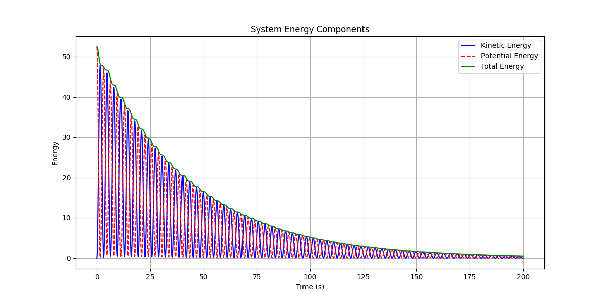
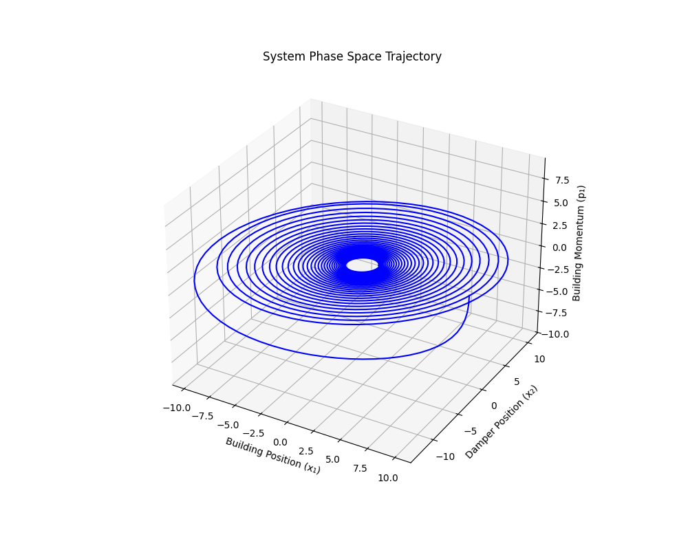
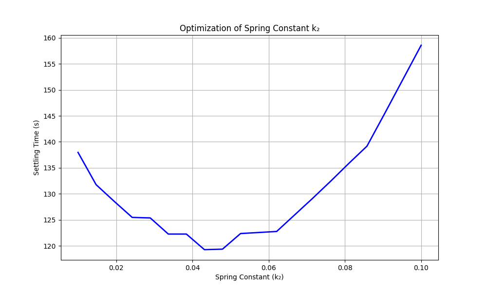

# Tuned Mass Damper System Analysis: The John Hancock Tower Case Study

## Introduction
The John Hancock Tower, standing at 790 feet as New England's tallest building, faced a significant engineering challenge shortly after its completion in 1976. Excessive swaying caused discomfort among its occupants. This project analyzes the implementation of a tuned mass damper (TMD) system used to mitigate this issue.


## Physical System Description
The building's dynamics can be modeled as a coupled oscillator system with these key components:
> [!NOTE]  
> - **Primary Mass ($m_1$):** Represents the building structure.
> - **Secondary Mass ($m_2$):** The tuned mass damper.
> - **Primary Spring ($k_1$):** Building's natural elasticity.
> - **Secondary Spring ($k_2$):** Damper's connection to the building.
> - **Damping Mechanism ($b$):** Energy dissipation system.

## Mathematical Model

### Governing Equations
The system is described by coupled second-order differential equations:

For the building ($m_1$):

$$
m_1\frac{d^2x_1}{dt^2} = -k_1(x_1 - L_1) + k_2(x_2 - x_1 - L_2) + b\left(\frac{p_2}{m_2} - \frac{p_1}{m_1}\right)
$$

For the damper ($m_2$):

$$
m_2\frac{d^2x_2}{dt^2} = -k_2(x_2 - x_1 - L_2) - b\left(\frac{p_2}{m_2} - \frac{p_1}{m_1}\right)
$$

### Energy Analysis
The system's total energy (Hamiltonian) is:

$$
H = \frac{p_1^2}{2m_1} + \frac{p_2^2}{2m_2} + \frac{k_1}{2}(x_1 - L_1)^2 + \frac{k_2}{2}(x_2 - x_1 - L_2)^2
$$

Energy dissipation due to damping is governed by:

$$
\frac{dH}{dt} = -b\left(\frac{p_2}{m_2} - \frac{p_1}{m_1}\right)^2
$$

---

## Implementation and Results

### Building and Damper Motion
  
*Figure 1: Time evolution of building and damper positions.*

### Energy Transfer Analysis
  
*Figure 2: Energy components over time.*

### Phase Space Trajectory
  
*Figure 3: 3D phase space representation.*

### Parameter Optimization
  
*Figure 4: Spring constant optimization.*


## Engineering Analysis

### Parameter Selection Rationale
- **Mass Ratio ($m_2/m_1 = 0.05$):**
    - Small enough to be practical.
    - Large enough to be effective.
    - Typical value for tall buildings.

- **Spring Constant ($k_2 \approx 0.05$):**
    - Matches building's natural frequency.
    - Optimizes energy transfer.
    - Minimizes settling time.

- **Damping Coefficient ($b = 0.1$):**
    - Provides critical damping.
    - Ensures efficient energy dissipation.
    - Prevents overdamping.


## Conclusion
This analysis demonstrates the effectiveness of the tuned mass damper in controlling building oscillations through:
- Optimal parameter selection.
- Efficient energy transfer and dissipation.
- Rapid convergence to stability.

The implemented solution successfully addresses the John Hancock Tower's swaying issues, providing a practical example of dynamic structural control.

> [!IMPORTANT]  
> ## Required Packages:
> ```bash
> pip install matplotlib numpy scipy pillow
> ```
